# k8s_example

## [Install prereqs](prereq.md)
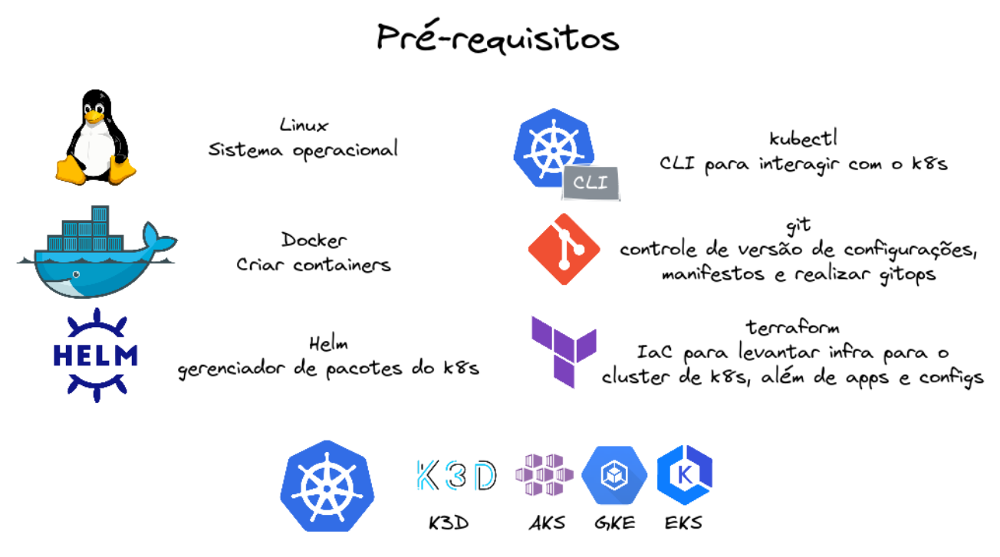

## Create Cluster
- `k3d cluster create k8sexample --volume $HOME/k8sexample:/var/lib/rancher/k3s/storage@all -s 1 --servers-memory 12Gb -a 3 --agents-memory 50gb --api-port 6443 -p 8081:80@loadbalancer`
  - storage class: local-path em $HOME/k8sexample
  - 1 control plane
  - 3 worker node
  - port-foward 80 para 8081

## Create Namespace
- `cd ./iac/k3d && terraform init && terraform plan && terraform apply -auto-approve && cd ../.. && kubectl get ns`

## Argo CD
- `helm upgrade --install -f https://raw.githubusercontent.com/vsvale/k8s_example/main/repository/helm-charts/argo-cd/values.yaml argocd argo/argo-cd --namespace cicd --debug --timeout 10m0s`
- Alterado o values para usar ingress (params.server.insecure: true,params.server.rootpath: '/argocd')
- watch kubectl get all -n cicd
- App of Apps: kubectl apply -f https://raw.githubusercontent.com/vsvale/k8s_example/main/example.yaml
- [http://127.0.0.1:8081/argocd/login](http://127.0.0.1:8081/argocd/login)
- user: admin
- password: `kubectl -n cicd get secret argocd-initial-admin-secret -o jsonpath="{.data.password}" | base64 -d  | more`
- caso algo fique como degraded basta deletar, o argo irá recriar novamente. Apenas não delete o cicd/k8sexample

## Kafka
- Strimzi via helm-chart com default values
- metricas para promoetheus
- 3 Broker ephemeral Kafka 3.2.3
- Kafka connect com a image mateushenrique/owshq-kafka-connect-strimzi:3.2.3
- Schema registry 6.1.0
- Cruise control (necessario 3 brokers)
- Kafka Connectors em repository/yamls/ingestion/connectors

## MiniO
- Utilizando o helm chart minio/operator com valores default
- loadbalancer para a UI (9089) do minio e para a API (8686)
- JWT: `kubectl get secret console-sa-secret -o jsonpath="{.data.token}" -n deepstorage| base64 --decode`
- create tenant examples3 com TLS disable
- download credentials
- porta 9090 para acessar o console
- create landing and lakehouse buckets

## Spark
- Utilizando spark operator com valores default
- crb para o spark operator

## YugabyteDB
- Utilizando yugabytedb helm chart personalizando user e database:  
```authCredentials:
  ysql:
    user: "plumber"
    password: "PlumberSDE"
    database: "salesdw"
```
## Postgres
- banco de metadados para o Lenses e Airflow

## Airflow
- `helm upgrade --install -f ./repository/helm-charts/airflow/values.yaml airflow apache-airflow/airflow --namespace orchestrator --debug --timeout 10m0s`
- Utilizando helm chart personalizando:
  - imagem: vsvale/vsvale-airflow:2.4.1 [more info](code/airflow)
  - gitsync para https://github.com/vsvale/k8s_example.git
- porta 8787
- USERNAME: admin
- PASSWORD: admin
- necessário criar as conexões:
  - kubernetes Connection: {"name":"kubeconnect", "in-cluster":true} 
  - MiniO Connection: {"aws_access_key_id": "YOURACCESSKEY", "aws_secret_access_key": "YOURSECRETKEY", "host": "http://172.18.0.2:8686"}
  - YugabyteDB Connection: {"name": "yugabytedb_ysql", "host": "yb-tservers.database.svc.cluster.local", "schema": "salesdw", "login": "plumber", "password": "PlumberSDE", "port": "5433"}


## Lenses
- opcional, apenas para facilitar a visualização dos tópicos kafka
- porta 3030
- Necessario substituir a license no values
- USERNAME: admin
- PASSWORD: admin

## Example
- O estudo de caso utiliza a AdventureWorksLT como source dos dados. Esses dados serão utilizados para alimentar algumas tabelas no DW presente no YugabyteDB.
- O nome do banco de origem é o sampledb, um sqlserver que não contém o CDC habilitado:
```
  - HOST: sampledb.mssql.somee.com
  - USERNAME: vsvale_SQLLogin_1
  - PASSWORD: 41y12q7yhx
  - DATABASE: sampledb
```
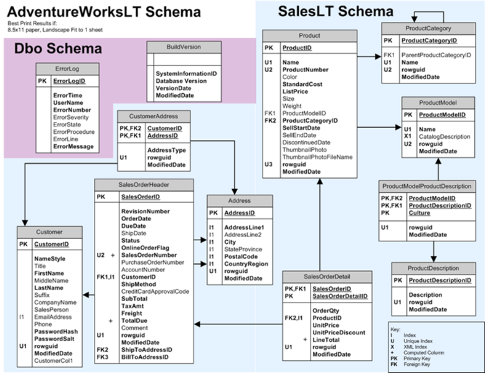

- É necessário criar as tabelas no DW, com o seguinte [script](code/yugabytedb/yb-salesdw.sql)

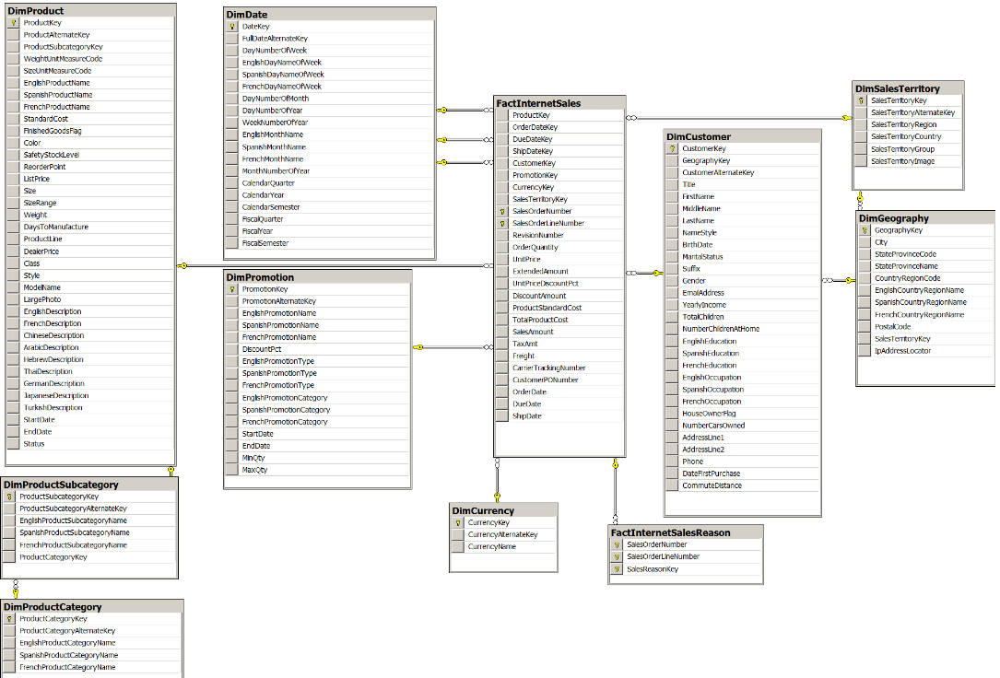

- dimproduct, dimproductcategory, factinternetsales, dimcustomer, dimgeografy terão seus dados oriundos do banco OLTP sampledb
- dimproductsubcategory, dimdate, dimpromotion, dimcurrency, factinternetsalesreason, dimsalesterritory terão seus dados disponibilizados em [csv](code/minio) no bucket landing no minio

### From sampledb to Kafka
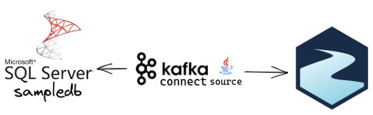
- Através do Kafka Connect JDBC extraimos os dados do sampledb e disponibilizamos no Kafka, como utiliza uma chave e um timestamp será possível identificar inserts e updates
- Os connectors source estão disponíveis em [repository/yamls/ingestion/connectors/src](repository/yamls/ingestion/connectors/src)
- Para ver os logs: kubectl get kafkaconnectors <nomedoconnector> -oyaml -n ingestion
- Para pegar os nomes dos connectors: `kubectl get kafkaconnectors -n ingestion`
- Se utilizar o lenses é possivel identificar que a quantidade de registros dos tópicos batem com a quantidade de registro de cada tabela:

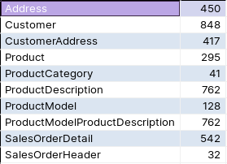
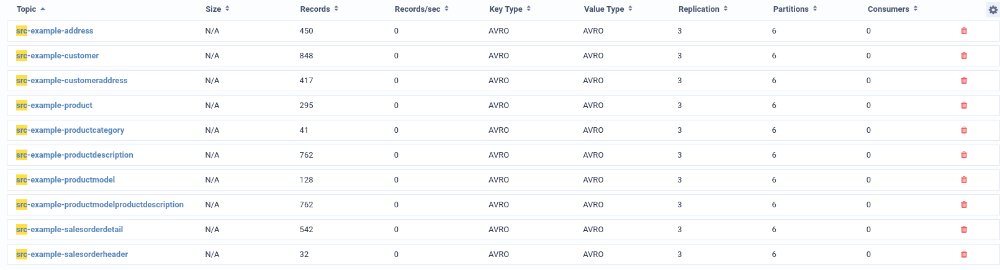
- Query utilizado para o count no sampledb:
```
SELECT 'Address',count(*) from SalesLT.Address UNION SELECT 'Customer',count(*) from SalesLT.Customer UNION SELECT 'CustomerAddress',count(*) from SalesLT.CustomerAddress 
UNION SELECT 'Product',count(*) from SalesLT.Product UNION SELECT 'ProductCategory',count(*) from SalesLT.ProductCategory 
UNION SELECT 'ProductDescription',count(*) from SalesLT.ProductDescription UNION SELECT 'ProductModel',count(*) from SalesLT.ProductModel 
UNION SELECT 'ProductModelProductDescription',count(*) from SalesLT.ProductModelProductDescription UNION SELECT 'SalesOrderDetail',count(*) from SalesLT.SalesOrderDetail 
UNION SELECT 'SalesOrderHeader',count(*) from SalesLT.SalesOrderHeader;
```

### From Kafka to S3: Connect
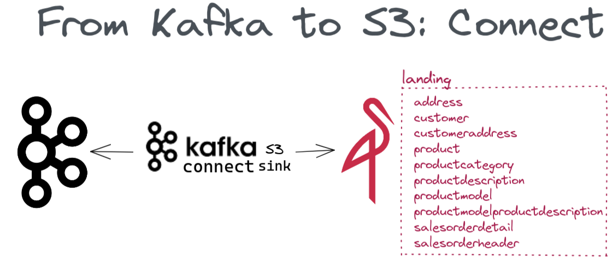
- Atraveés do Kafka connect S3 sink consumimos os dados dos tópicos, transformamos para parquet e disponibilizamos na lanzing zone no MiniO.
- Os connectors sink estão disponíveis em [repository/yamls/ingestion/connectors/sink](repository/yamls/ingestion/connectors/sink)
- É necessário alterar aws.access.key.id e aws.secret.access.key para credenciais baixadas durante a criação do tenant
- Para ver os logs: kubectl get kafkaconnectors <nomedoconnector> -oyaml -n ingestion
- Para pegar os nomes dos connectors: `kubectl get kafkaconnectors -n ingestion`
- verifique no console (porta 9090) no bucket landing do Minio se os objetos foram criados

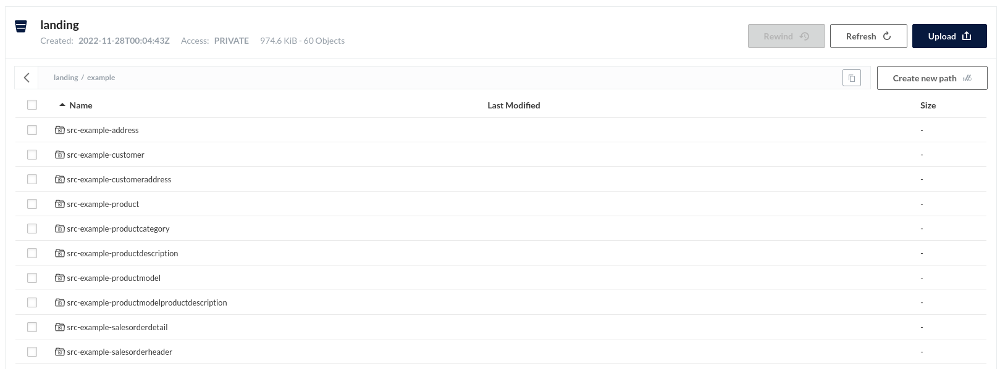

### Lake house
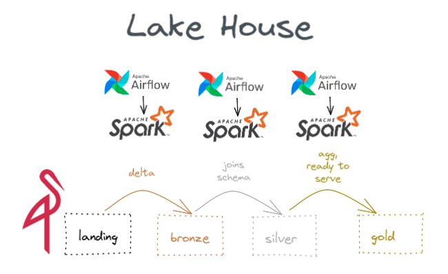
- O Airflow aciona o job Spark, o Spark Operator cria o driver e workers necessários para o processamento no Kubernetes. O dado é processado e salvo em outra camada.
- Na camada Bronze os dados são convertidos de [Parquet para delta]()
- Na camada Silver ocorre schema enforcement e joins necessários para formar as dimensões e fatos
- Na camada gold teremos a versão final da tabela que será salvo no DW, para isso será realizado o merge entre o conteudo da silver e da tabela destino
- Para processar com o Spark precisamos gerar uma imagem OCI.
  - Primeiramente criamos uma [imagem base](code/spark/base_image) com todos os [jars](https://github.com/vsvale/kappa_code/tree/main/processing/spark/base_image/jars) necessários, essa imagem é salva em um [repositório de imagens](https://hub.docker.com/repository/docker/vsvale/spark_base_image)
  - utilizamos a imagem base para criar uma nova imagem, dessa vez com os scripts que desejamos processar.
  - Então é criado um arquivo de configuração (yaml) que informa qual o script que será processado e as configurações de execução, como quantidade de cpu e memoria, dos drivers e executors
  - Em um processamento batch utilizamos o Airflow para aplicar o arquivo de configuração no Kubernetes, em um processamento Stream aplicamos manualmente a configuração.
  - No caso especifico desse exemplo antes de montar a imagem é necessário configurar o [settings](code/spark/example/settings.py). Além disso, é necessário corrigir as configurações do S3 dos arquivos de configuração(yaml) das [dags](dags)

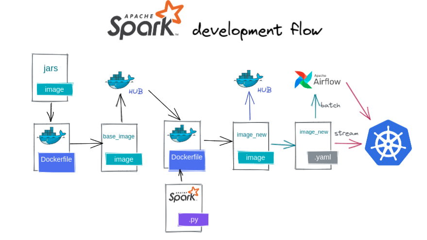

### From S3 to Kafka via Spark Structure Stream

dimcurrency, dimdate, dimproductsubcategory, dimpromotion, dimsalesterritory, factinternetsalesreason
code/minio/example/dw-files
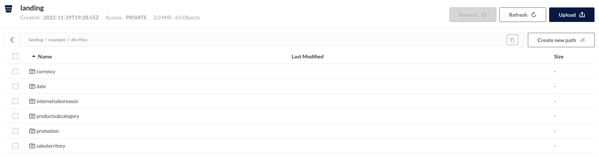
code/spark/example/stream
repository/yamls/spark/structurestream
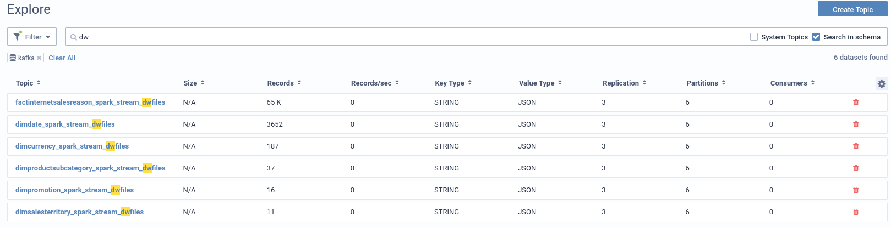
